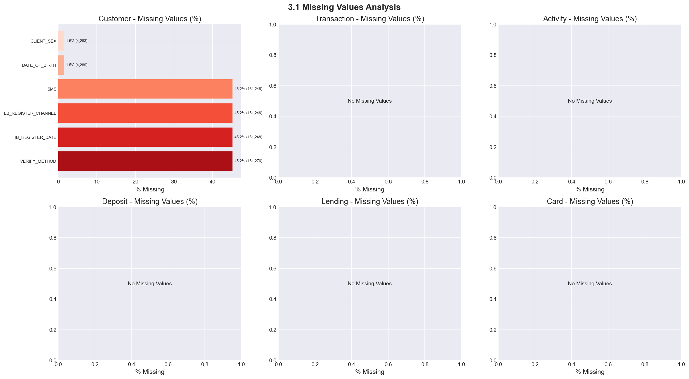
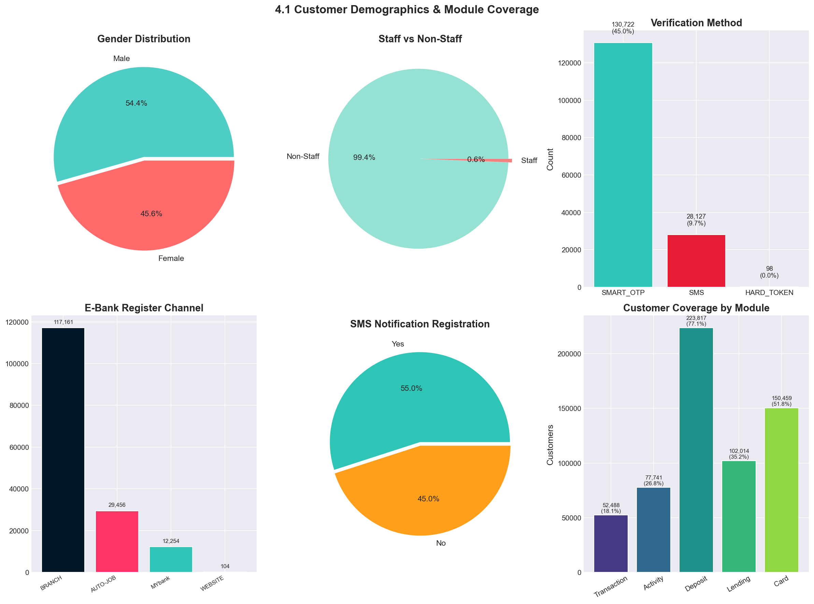
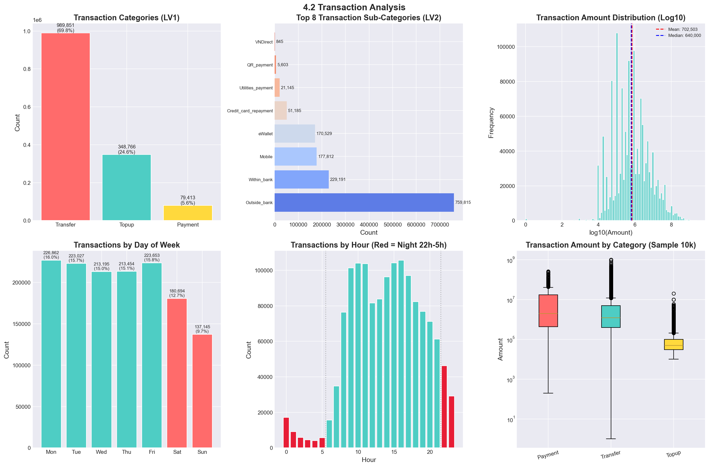
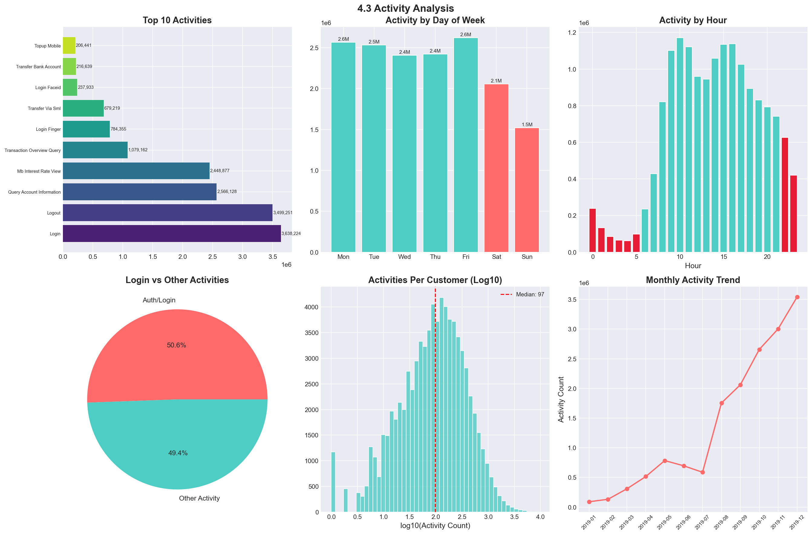
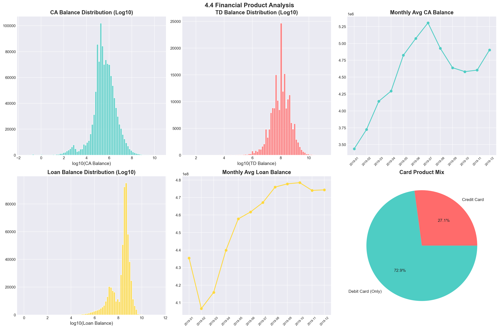
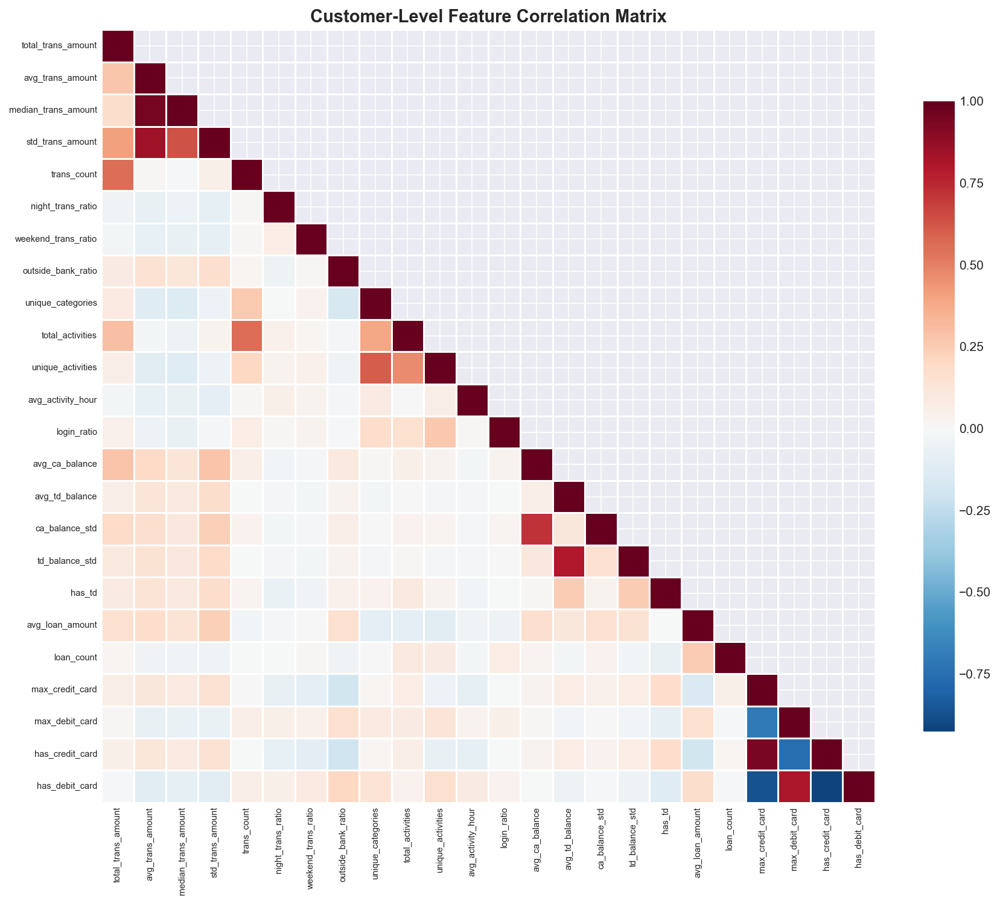
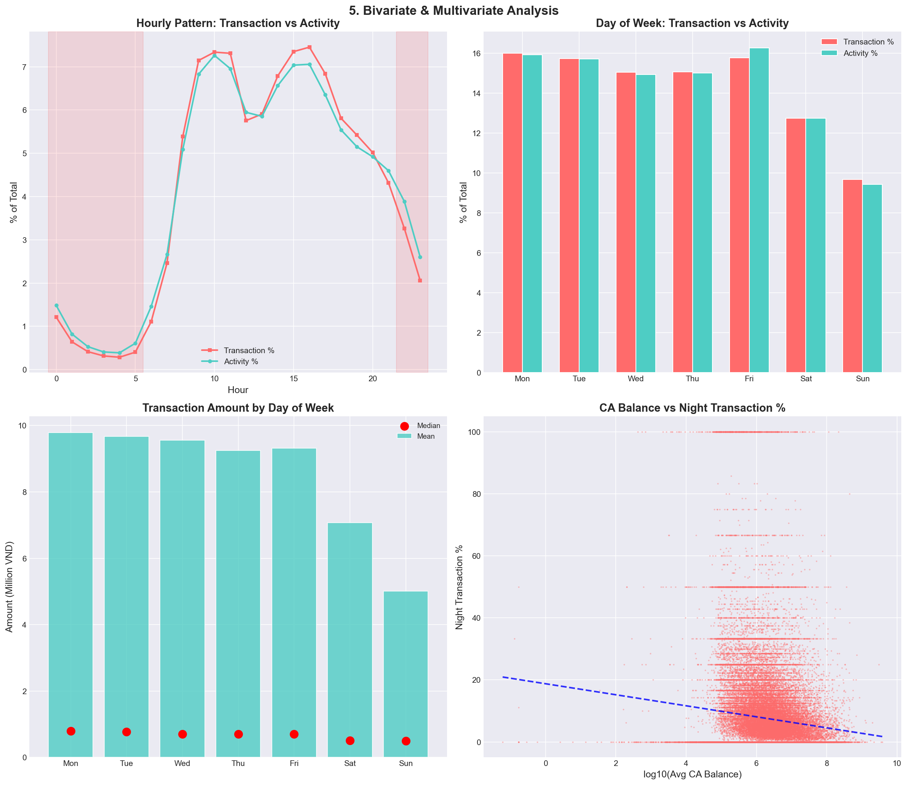
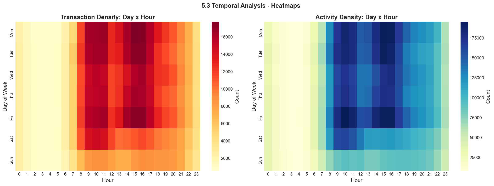
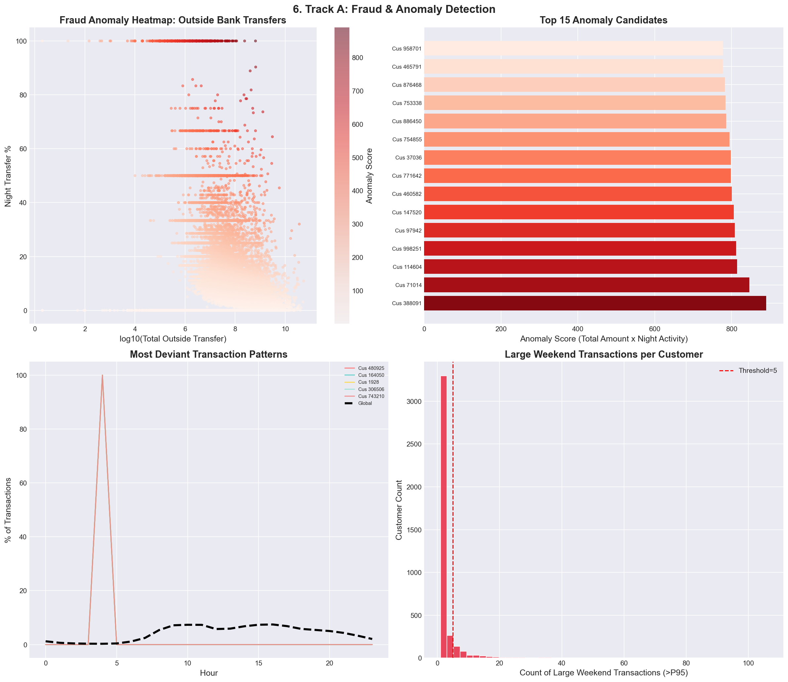

# BÁO CÁO EDA TUẦN 1
## Phân Tích Dữ Liệu Khách Hàng Ngân Hàng 360°

**Nhóm:** ML End Term  
**Ngày:** 10/05/2026  
**Track đề xuất:** Fraud & Anomaly Detection (A)  

---

## 1. Introduction

### 1.1 Project Overview

#### Giới thiệu bài toán
Dự án xây dựng mô hình học máy trên bộ dữ liệu 360° của khách hàng ngân hàng, bao gồm: nhân khẩu học, hành vi số (digital footprint), và sở hữu sản phẩm tài chính. Mục tiêu là xây dựng các mô hình giúp tăng cường bảo mật và thúc đẩy tăng trưởng cá nhân hóa.

#### Track nhóm chọn: **A - Fraud & Anomaly Detection**
Nhóm đề xuất chọn Track A với các lý do sau:
- Dữ liệu có yếu tố thời gian phong phú (Activity logs, Transaction timestamps) → phù hợp xây dựng behavioral baseline
- Phát hiện bất thường dựa trên temporal pattern là hướng tiếp cận mạnh với dữ liệu này
- Có thể xác định các rủi ro: account takeover, unauthorized transfer, money laundering patterns
- Dữ liệu transaction có các category rủi ro cao (Outside_bank transfer, night-time activity)

#### Ý nghĩa Business
- **Giảm rủi ro giao dịch:** Phát hiện sớm các giao dịch bất thường, ngăn chặn tổn thất tài chính
- **Bảo vệ khách hàng:** Xác định account takeover qua phân tích sai lệch hành vi
- **Tuân thủ AML:** Phát hiện patterns của money laundering (placement, layering, integration)
- **Giảm false positive:** Xây dựng behavioral baseline chính xác cho từng khách hàng

### 1.2 Dataset Overview

Bộ dữ liệu gồm **6 bảng** với tổng cộng **~21.5 triệu records**, liên kết qua `CUSTOMER_NUMBER`.

```
Customer (290,223) 
├── Transaction (1,418,030)  ── Event-based: từng giao dịch riêng lẻ
├── Activity (16,132,675)    ── Event-based: từng hoạt động digital
├── Deposit (1,258,424)      ── Monthly snapshot: 9 tháng
├── Lending (576,431)        ── Monthly snapshot: 9 tháng
└── Card (871,589)           ── Monthly snapshot: 9 tháng
```

| Bảng | Số dòng | Số cột | Loại dữ liệu | Thời gian |
|------|---------|--------|-------------|-----------|
| Data_Customer | 290,223 | 9 | Customer profile | Static |
| Data_Transaction | 1,418,030 | 8 | Event log | 01/2019 - 12/2019 |
| Data_Activity | 16,132,675 | 6 | Event log | 01/2019 - 09/2019 |
| Data_Deposit | 1,258,424 | 6 | Monthly snapshot | 01/2019 - 09/2019 |
| Data_Lending | 576,431 | 4 | Monthly snapshot | 01/2019 - 09/2019 |
| Data_Card | 871,589 | 4 | Monthly snapshot | 01/2019 - 09/2019 |

**Điểm đáng chú ý:**
- Transaction kéo dài đến 12/2019, trong khi các bảng snapshot chỉ đến 09/2019
- Activity có số lượng record lớn nhất (16.1M), gấp ~11 lần Transaction
- Chỉ 9,362 khách hàng (~3.2%) xuất hiện trong tất cả 6 bảng

---

## 2. Data Understanding

### 2.1 Data Dictionary Summary

#### Data_Customer
| Column | Meaning | Data Type |
|--------|---------|-----------|
| CUSTOMER_NUMBER | Encoded Customer ID | int |
| CLIENT_SEX | Customer Gender (M/F) | text |
| CLIENT_CREATE_DATE | Date CIF opened | date |
| DATE_OF_BIRTH | Customer DOB | date |
| STAFF | Staff or not (Y/N) | text |
| IB_REGISTER_DATE | E-bank account open date | date |
| EB_REGISTER_CHANNEL | Channel e-bank opened | text |
| SMS | SMS notification registration | text |
| VERIFY_METHOD | Online transaction verify method | text |

#### Data_Transaction
| Column | Meaning | Data Type |
|--------|---------|-----------|
| TRANS_LV1 | Transaction group level 1 | text |
| TRANS_LV2 | Transaction group level 2 | text |
| TRANS_DATE | Transaction date | date |
| DAY_OF_WEEK | Day of week | text |
| TRANS_HOUR | Transaction hour (0-23) | int |
| TRANS_NO | Number of transactions | int |
| TRANS_AMOUNT | Transaction Amount (VND) | float |
| CUSTOMER_NUMBER | Customer ID | int |

#### Data_Activity
| Column | Meaning | Data Type |
|--------|---------|-----------|
| ACTIVITY_DATE | Activity date | date |
| DAY_OF_WEEK | Day of week | text |
| ACTIVITY_HOUR | Activity hour (0-23) | int |
| ACTIVITY_NO | Activity code number | int |
| CUSTOMER_NUMBER | Customer ID | int |
| ACTIVITY_NAME | Activity description | text |

#### Data_Deposit
| Column | Meaning | Data Type |
|--------|---------|-----------|
| MONTH | Reporting month | date |
| COUNT_CA_ACCT | Number of Current Accounts | int |
| AVG_CA_BALANCE | Monthly Avg CA Balance (VND) | float |
| COUNT_TD_ACCT | Number of Term Deposit Accounts | int |
| AVG_TD_BALANCE | Monthly Avg TD Balance (VND) | float |
| CUSTOMER_NUMBER | Customer ID | int |

#### Data_Lending
| Column | Meaning | Data Type |
|--------|---------|-----------|
| MONTH | Reporting month | date |
| COUNT_OF_LOAN | Number of loan accounts | int |
| AVG_LOAN_AMOUNT | Monthly Avg Loan Balance (VND) | float |
| CUSTOMER_NUMBER | Customer ID | int |

#### Data_Card
| Column | Meaning | Data Type |
|--------|---------|-----------|
| MONTH | Reporting month | date |
| COUNT_CREDITCARD | Number of Credit Cards | int |
| COUNT_DEBITCARD | Number of Debit Cards | int |
| CUSTOMER_NUMBER | Customer ID | int |

### 2.2 Dataset Statistics

| Metric | Customer | Transaction | Activity | Deposit | Lending | Card |
|--------|----------|-------------|----------|---------|---------|------|
| Rows | 290,223 | 1,418,030 | 16,132,675 | 1,258,424 | 576,431 | 871,589 |
| Columns | 9 | 8 | 6 | 6 | 4 | 4 |
| Unique Customers | 290,223 | 52,488 | 77,741 | 223,817 | 102,014 | 150,459 |
| Coverage (% of all customers) | 100% | 18.1% | 26.8% | 77.1% | 35.1% | 51.8% |

### 2.3 Initial Observations

1. **Dữ liệu có yếu tố time-series mạnh:** Transaction và Activity là event-based với timestamp chi tiết (ngày + giờ); Deposit/Lending/Card là monthly snapshot
2. **Độ phủ không đồng đều:** Chỉ 18% khách hàng có giao dịch e-bank, 27% có digital activity, nhưng 77% có tài khoản deposit
3. **Chênh lệch thời gian:** Transaction có đến 12/2019; Activity/Deposit/Lending/Card chỉ đến 09/2019 → 3 tháng gap cần lưu ý khi merge dữ liệu
4. **Dữ liệu đã được encoded:** CUSTOMER_NUMBER đã được mã hóa, không có thông tin định danh thực

---

## 3. Data Quality Assessment

### 3.1 Missing Values Analysis



#### Customer Table - Missing Pattern Đặc Biệt

| Column | Missing Count | % Missing | Business Interpretation |
|--------|--------------|-----------|------------------------|
| IB_REGISTER_DATE | 131,248 | 45.2% | Khách hàng chưa đăng ký e-banking |
| EB_REGISTER_CHANNEL | 131,248 | 45.2% | Cùng nhóm với trên |
| SMS | 131,248 | 45.2% | Cùng nhóm với trên |
| VERIFY_METHOD | 131,276 | 45.2% | Cùng nhóm với trên |
| CLIENT_SEX | 4,283 | 1.5% | Dữ liệu thiếu khi nhập |
| DATE_OF_BIRTH | 4,289 | 1.5% | Cùng nhóm với CLIENT_SEX |

**Insight quan trọng:** ~45% khách hàng có missing values ở IB_REGISTER_DATE, EB_REGISTER_CHANNEL, SMS, VERIFY_METHOD — đây KHÔNG phải lỗi dữ liệu mà là **khách hàng chưa đăng ký Internet Banking**. Đây là một đặc trưng có ý nghĩa: nhóm này không có digital footprint.

- **Transaction, Activity, Deposit, Lending, Card:** 0 missing values → dữ liệu sạch

### 3.2 Duplicate Analysis

- **Customer:** 0 duplicate CUSTOMER_NUMBER — mỗi khách hàng là duy nhất
- **Transaction/Activity:** Có thể có nhiều records cho cùng customer + timestamp (các giao dịch/hoạt động khác nhau) → đây là expected behavior, không phải duplicate
- **Deposit/Lending/Card:** Mỗi customer có tối đa 1 record/tháng → cấu trúc monthly snapshot hợp lý

### 3.3 Outlier Detection

| Metric | Q1 | Median | Q3 | Max | % Outliers (IQR) |
|--------|-----|--------|-----|-----|------------------|
| Transaction Amount | 110,000 | 640,000 | 3,000,000 | 2,458,000,000 | 15.6% |
| CA Balance | 86,355 | 289,749 | 1,334,255 | 26,031,220,000 | ~20% |
| TD Balance | 0 | 0 | 0 | 125,500,000,000 | ~10% |
| Loan Amount | 75,102,520 | 345,138,000 | 560,669,500 | 297,932,900,000 | ~12% |

**Nhận xét:** Tỷ lệ outlier cao (15-20%) không nhất thiết là lỗi — trong lĩnh vực tài chính, các giao dịch/số dư lớn là **hành vi thực của khách hàng VIP/doanh nghiệp**. Với Fraud track, chính những outlier này là **ứng viên cần được phân tích kỹ**.

### 3.4 Data Consistency

- **Transaction Amount:** Min = 1 VND → các giao dịch rất nhỏ có thể là test transactions hoặc micro-transactions, cần xem xét khi xây dựng baseline
- **Activity vs Transaction dates:** Activity có 45 loại hoạt động khác nhau, phong phú hơn nhiều so với 3 loại giao dịch chính
- **DATE_OF_BIRTH:** Một số có năm sinh rất cũ (1973, 1982...) → khách hàng ở nhiều độ tuổi
- **STAFF:** Chỉ 1,869/290,223 (0.6%) là nhân viên ngân hàng

---

## 4. Univariate Analysis

### 4.1 Customer Demographics



| Feature | Distribution | Insight |
|---------|-------------|---------|
| Gender | M: 53.6%, F: 44.9%, Missing: 1.5% | Phân bố khá cân bằng, hơi nghiêng về nam |
| Staff | Non-Staff: 99.4%, Staff: 0.6% | Hầu hết là khách hàng thông thường |
| Verify Method | SMART_OTP: 82.2%, SMS: 17.7%, HARD_TOKEN: 0.1% | OTP là phương thức xác thực chính |
| Register Channel | BRANCH: 73.7%, AUTO-JOB: 18.5%, MYbank: 7.7% | Đa số đăng ký tại chi nhánh |
| SMS | Y: 55.0%, N: 45.0% | ~1 nửa khách hàng đăng ký SMS |

**Module Coverage:** Deposit (77%) > Card (52%) > Lending (35%) > Activity (27%) > Transaction (18%)

### 4.2 Transaction Analysis



#### Phân bố giao dịch theo Category (LV1):
| Category | Count | % | Avg Amount |
|----------|-------|---|------------|
| Transfer | 989,851 | 69.8% | 11,020,846 VND |
| Topup | 348,766 | 24.6% | 205,752 VND |
| Payment | 79,413 | 5.6% | 18,335,323 VND |

**Insight:**
- **Transfer chiếm gần 70%** giao dịch, chủ yếu là Outside_bank (53.6% tổng)
- **Topup** giá trị nhỏ (median 60,000 VND) nhưng tần suất cao → giao dịch hàng ngày
- **Payment** giá trị lớn nhất (mean 18.3M), chủ yếu là credit card repayment

#### Phân bố theo Thời gian:
- **Giờ cao điểm:** 8h-17h (giờ hành chính), với đỉnh lúc 16h
- **Giờ thấp điểm:** 22h-5h (đêm) — chỉ 8.6% giao dịch nhưng **đây là vùng rủi ro cao cho Fraud detection**
- **Ngày trong tuần:** Mon-Fri khá đều (~15-16% mỗi ngày), Sat (12.7%), Sun (9.7%) → cuối tuần ít giao dịch hơn

### 4.3 Activity Analysis



#### Top 5 Hoạt động Digital:
| Activity | Count | % |
|----------|-------|---|
| LOGIN | 3,638,224 | 22.6% |
| LOGOUT | 3,499,251 | 21.7% |
| QUERY_ACCOUNT_INFORMATION | 2,566,128 | 15.9% |
| MB_INTEREST_RATE_VIEW | 2,448,877 | 15.2% |
| TRANSACTION_OVERVIEW_QUERY | 1,079,162 | 6.7% |

**Insight:**
- Authentication (LOGIN + LOGOUT + LOGIN_FINGER + LOGIN_FACEID) chiếm ~50% tổng activity
- Có 45 loại activity khác nhau → đa dạng hành vi số
- Xem lãi suất (MB_INTEREST_RATE_VIEW) phổ biến → khách hàng quan tâm đến sản phẩm tài chính
- Activity pattern theo giờ gần giống transaction — hoạt động mạnh giờ hành chính

### 4.4 Financial Product Analysis



| Metric | Value |
|--------|-------|
| Customers with CA | ~223,817 (77.1%) |
| Customers with TD | ~190,248 rows (có tháng có TD) |
| Customers with Loans | 102,014 (35.1%) |
| Customers with Credit Card | ~241,629 rows |
| Customers with Debit Card | ~648,922 rows |

**Xu hướng theo thời gian (01/2019 - 09/2019):**
- Số lượng tài khoản CA tăng đều từ 11K → 147K → **tăng trưởng khách hàng mạnh trong năm**
- CA Balance trung bình dao động 3.4M - 5.3M VND
- TD Balance lớn hơn đáng kể (mean ~50M VND) → khách hàng có TD thường là khách hàng có tài sản

---

## 5. Bivariate & Multivariate Analysis

### 5.1 Correlation Analysis



**Các mối quan hệ đáng chú ý:**
- `trans_count` và `total_activities` có tương quan dương trung bình → khách hàng giao dịch nhiều cũng hoạt động digital nhiều
- `avg_ca_balance` và `avg_td_balance` có tương quan yếu → 2 sản phẩm phục vụ phân khúc khác nhau
- `night_trans_ratio` và `outside_bank_ratio` có tương quan nhẹ → giao dịch đêm thường là chuyển tiền ra ngoài
- `has_credit_card` tương quan với `avg_ca_balance` và `trans_count` → khách hàng có thẻ tín dụng thường active hơn

### 5.2 Behavioral Analysis



**Phát hiện chính:**

1. **Transaction vs Activity pattern:** Cả 2 có pattern theo giờ gần giống hệt nhau → hành vi giao dịch gắn liền với digital activity
2. **Weekend vs Weekday:**
   - Weekend giao dịch ít hơn 22.4% nhưng giá trị thấp hơn (mean 6.2M vs 9.5M)
   - Weekend activity giảm ~30% so với weekday
3. **CA Balance vs Night Transaction:** Không có tương quan rõ ràng → giao dịch đêm xảy ra ở mọi phân khúc, không chỉ khách hàng balance thấp
4. **Large weekend transactions:** Một số ít khách hàng có >5 giao dịch lớn (>P95) vào cuối tuần → **ứng viên fraud**

### 5.3 Temporal Analysis



- **Heatmap Day×Hour** cho thấy giao dịch tập trung mạnh vào 8h-17h các ngày trong tuần
- **Cuối tuần** vẫn có giao dịch nhưng thưa hơn và trải đều hơn trong ngày
- **Activity heatmap** có pattern tương tự nhưng density cao hơn (16M vs 1.4M records)
- Không thấy dấu hiệu seasonality rõ rệt theo tháng

---

## 6. Track-Specific EDA: Fraud & Anomaly Detection



### 6.1 Anomaly Candidate Identification

**Phân tích Outside Bank Transfers:**
- 759,815 outside bank transfers từ 52,488 khách hàng
- Top customer thực hiện 968 outside transfers với tổng giá trị 36.5 tỷ VND
- Một customer có 310/968 giao dịch outside bank vào ban đêm (32%) → **cực kỳ đáng ngờ**

**Phân tích Night-time Activity (22h-5h):**
- 121,967 giao dịch đêm (8.6% tổng giao dịch)
- Mean amount giao dịch đêm: 3.95M VND (thấp hơn overall mean 8.77M VND)
- Tuy nhiên, top outliers có giao dịch đêm giá trị rất lớn

### 6.2 Behavioral Baseline Indicators

Các features có tiềm năng xây dựng baseline cho mỗi khách hàng:

1. **Temporal Normality:** Giờ giao dịch thông thường, ngày trong tuần thông thường
2. **Amount Normality:** Phân phối số tiền giao dịch cá nhân (mean ± 2σ)
3. **Category Normality:** Loại giao dịch thường xuyên
4. **Frequency Normality:** Số lượng giao dịch trung bình mỗi ngày/tuần
5. **Channel Consistency:** Thiết bị/phương thức xác thực thường dùng

### 6.3 Money Laundering Pattern Indicators

- **Placement:** Giao dịch outside bank giá trị lớn đột biến
- **Layering:** Nhiều giao dịch nhỏ liên tiếp trong thời gian ngắn (TRANS_NO cao)
- **Integration:** Chuyển tiền từ outside bank về tài khoản, sau đó rút/mua tài sản

---

## 7. Feature Engineering Ideas

| Category | Feature | Ý nghĩa | Track |
|----------|---------|---------|-------|
| **Temporal** | `night_transaction_ratio` | % giao dịch đêm 22h-5h | Fraud |
| **Temporal** | `weekend_transaction_ratio` | % giao dịch cuối tuần | Fraud |
| **Temporal** | `hour_entropy` | Độ đa dạng giờ giao dịch | Fraud |
| **Temporal** | `active_days_per_week` | Số ngày hoạt động trung bình/tuần | All |
| **Behavioral** | `avg_transaction_amount` | Mức chi tiêu trung bình | All |
| **Behavioral** | `std_transaction_amount` | Độ biến động chi tiêu | Fraud |
| **Behavioral** | `category_diversity` | Số loại giao dịch khác nhau | All |
| **Behavioral** | `outside_bank_ratio` | % giao dịch ra ngoài ngân hàng | Fraud |
| **Behavioral** | `login_frequency` | Tần suất đăng nhập | Segmentation |
| **Financial** | `deposit_growth_rate` | Tăng trưởng tiền gửi | NBFO |
| **Financial** | `ca_to_td_ratio` | Tỷ lệ CA/TD balance | NBFO |
| **Financial** | `loan_to_deposit_ratio` | Tỷ lệ vay/tiền gửi | NBFO |
| **Financial** | `product_count` | Số lượng sản phẩm sở hữu | NBFO |
| **Anomaly** | `amount_zscore` | Z-score của số tiền so với lịch sử cá nhân | Fraud |
| **Anomaly** | `velocity_1h` | Số giao dịch trong 1 giờ gần nhất | Fraud |
| **Anomaly** | `velocity_24h` | Tổng giá trị giao dịch 24h qua | Fraud |
| **Anomaly** | `new_device_flag` | Đăng nhập từ thiết bị mới | Fraud |
| **Engagement** | `digital_engagement_score` | Điểm tổng hợp mức độ tương tác số | Segmentation |
| **Engagement** | `activity_diversity_index` | Độ đa dạng hoạt động | Segmentation |

---

## 8. Key Insights

### 8.1 Data Insights

1. **"Missing values không phải lúc nào cũng là lỗi":** 45% khách hàng missing IB_REGISTER_DATE không phải lỗi — họ chưa đăng ký e-banking. Đây là một feature có ý nghĩa: phân biệt khách hàng digital vs traditional.

2. **"Phần lớn giao dịch diễn ra giờ hành chính, nhưng 8.6% giao dịch đêm cần được giám sát đặc biệt":** Đây là vùng rủi ro cho Fraud detection. Giao dịch đêm có mean amount thấp hơn nhưng có các outlier cực lớn.

3. **"Transfer ra ngoài ngân hàng (Outside_bank) chiếm 53.6% tổng giao dịch — là category rủi ro cao nhất":** Kết hợp với night-time pattern tạo thành tín hiệu fraud mạnh.

4. **"Chỉ 3.2% khách hàng có mặt trong tất cả 6 bảng — đa số khách hàng có partial data":** Cần chiến lược xử lý missing data phù hợp, không thể đơn giản drop các khách hàng không đủ data.

5. **"Cuối tuần ít giao dịch hơn 22% nhưng giao dịch cuối tuần giá trị lớn (>P95) là dấu hiệu bất thường":** Hành vi lệch khỏi pattern thông thường.

### 8.2 Business Insights

6. **"Khách hàng có xu hướng tăng trưởng mạnh trong năm 2019":** CA accounts tăng từ 11K → 147K chỉ trong 9 tháng → ngân hàng đang mở rộng nhanh.

7. **"Khách hàng xem lãi suất (2.4M lượt) — tín hiệu cho cross-sell":** Hành vi quan tâm đến lãi suất là cơ hội để giới thiệu sản phẩm tiết kiệm/đầu tư.

8. **"Top 10 outside transfer customers có giá trị giao dịch từ 32-543 tỷ VND":** Cần phân biệt giữa khách hàng doanh nghiệp (volume lớn, pattern đều) và fraud (pattern bất thường).

---

## 9. Challenges & Limitations

| Challenge | Impact | Mitigation |
|-----------|--------|------------|
| **Thiếu label cho Fraud** | Không có ground truth để supervised learning | Sử dụng unsupervised/semi-supervised (Isolation Forest, AutoEncoder) |
| **Imbalance dữ liệu** | Fraud cases rất hiếm (<1% nếu có) | SMOTE, anomaly detection thay vì classification |
| **Missing data pattern** | 45% customers không có e-banking | Feature engineering: coi missing là 1 feature |
| **Gap thời gian 3 tháng** | Transaction đến 12/2019, các bảng khác đến 09/2019 | Cắt transaction đến 09/2019 khi merge |
| **Dữ liệu encoded** | Không có thông tin thực về khách hàng | Tập trung vào behavioral patterns |
| **Không có device/fingerprint** | Khó phát hiện device-based fraud | Sử dụng behavioral anomaly thay thế |
| **Activity NO là code, không phải count** | ACTIVITY_NO có thể không phải số lượng | Đọc lại data dictionary |

---

## 10. Next Steps (Week 2 Plan)

### 10.1 Preprocessing
- [ ] Parse toàn bộ date columns về datetime format
- [ ] Merge các bảng theo CUSTOMER_NUMBER + MONTH (cho monthly tables)
- [ ] Xử lý missing IB_REGISTER_DATE: tạo flag `has_ebanking`
- [ ] Filter transaction data đến 09/2019 để đồng bộ với các bảng khác
- [ ] Xử lý outliers: capping vs flagging (với fraud track, giữ lại outliers làm feature)

### 10.2 Feature Engineering
- [ ] Build behavioral aggregation features từ Transaction và Activity
- [ ] Build temporal features: hour patterns, day-of-week patterns
- [ ] Build financial features: balance trends, product holdings
- [ ] Create anomaly candidate labels (heuristic-based)
- [ ] Feature selection bằng correlation analysis và mutual information

### 10.3 Baseline Models (Tối thiểu 3 models)
| Model | Mục đích | Ưu điểm |
|-------|----------|---------|
| **Isolation Forest** | Anomaly detection baseline | Không cần label, interpretable |
| **AutoEncoder** | Deep anomaly detection | Học được non-linear patterns |
| **XGBoost/LightGBM** | Supervised (với pseudo-labels) | Feature importance, strong baseline |
| **LOF (Local Outlier Factor)** | Density-based anomaly | Phát hiện local outliers |

### 10.4 Evaluation Strategy
- Với unsupervised: phân tích top anomaly scores, kiểm tra tính hợp lý
- Domain expert validation: xác nhận với business rules
- Cross-validation temporal: train trên tháng đầu, test trên tháng sau

---

## Appendix: Visualization Index

| Figure | File | Description |
|--------|------|-------------|
| Fig 1 | `eda_fig1_missing_values.png` | Missing Values Analysis per Table |
| Fig 2 | `eda_fig2_customer_demographics.png` | Customer Demographics & Module Coverage |
| Fig 3 | `eda_fig3_transaction_analysis.png` | Transaction Distribution & Patterns |
| Fig 4 | `eda_fig4_activity_analysis.png` | Digital Activity Analysis |
| Fig 5 | `eda_fig5_financial_products.png` | Financial Products Distribution |
| Fig 6 | `eda_fig6_bivariate_analysis.png` | Bivariate & Multivariate Analysis |
| Fig 7 | `eda_fig7_correlation_heatmap.png` | Customer-Level Feature Correlation |
| Fig 8 | `eda_fig8_fraud_track.png` | Fraud Track: Anomaly Candidates |
| Fig 9 | `eda_fig9_nbfo_track.png` | NBFO Track: Product Adoption |
| Fig 10 | `eda_fig10_segmentation_track.png` | Segmentation Track: Archetypes |
| Fig 11 | `eda_fig11_temporal_heatmaps.png` | Temporal Heatmaps Day×Hour |
